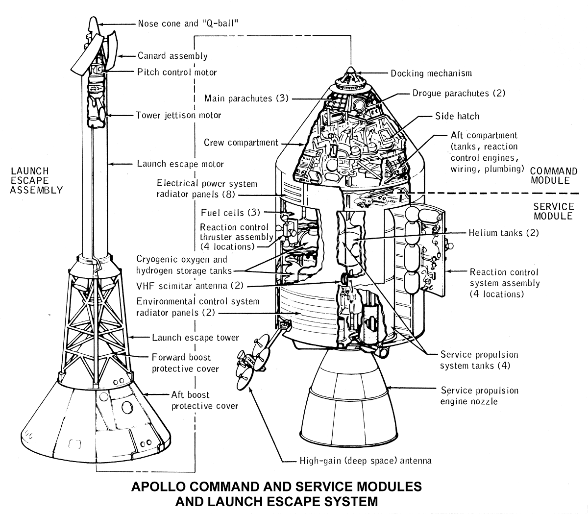

# Apollo-13kb

Join the crew of the unlucky Apollo-13 mission to the moon in this simplified historical simulation. Listen for commands from Mission Control, and control the spacecraft by simply pushing buttons. Keep the crew alive, and bring them home to Earth.

> On April 11, 1970 at 13:13, the 13th
Apollo mission was launched.
>
> Two days later the three astronauts
are headed towards the moon...

🌎....................🚀....................🌘

## Play it

- Latest Here: https://morph-games.github.io/apollo-13kb/
- Itch Release: https://deathray.itch.io/apollo-13kb

## JS13k

- [JS13k Rules](https://js13kgames.com/#rules): Make a game with a package size less than 13k (13,312 bytes)
- See all the entries for the competition at http://2024.js13kgames.com/

## Info

Final size for the competition: 

- 3 files: 32.4 KB (33,223 bytes)
- zip: 11.9 KB (12,251 bytes)

Libraries used:

- [ZzFX](https://github.com/KilledByAPixel/ZzFX)

## Postmortem

The jam's theme was *Triskaidekaphobia*, the fear of the number 13. For a while I was batting around an idea for a city-builder game, utilizing a stacked sprite technique I developed for [Nomads' Fire](https://deathray.itch.io/nomads-fire). I was going to have a catastrophe hit the city whenever a building grew to floor 13. But the more I thought it over, and the more days went by without coding (due to vacation and just life's demands), the more I realized that a city-builder is crazy ambitious, and I needed something more simple. Although this jam is a month long, I really only started working on the game in the last five days.

Just some basic shapes: 

Somehow I stumbled on the idea of using [The Apollo 13 mission](https://en.wikipedia.org/wiki/Apollo_13), and the entire Apollo Program, as inspiration. I wasn't sure how close to history I would stick, but as I poured through the wikipedia page, and other articles, I found myself drawn to the story as it really happened. Also as luck would have it, right as I was in the middle of coding this, Netflix released a new documentary ["Apollo 13 Survival"](https://www.netflix.com/title/81444292), which I had to instantly watch. (It's really good btw.)

In many ways this is a spiritual successor to *"[Return to the Moon](https://github.com/deathraygames/lunar-lander-13k)"*, aka. "Lunar Lander 13k" ([play](https://deathraygames.github.io/lunar-lander-13k/src/)). I used a similar art style for both: vector lines on a dark background. I really like the simplicity and scalability of working with SVGs, and the line drawings remind me of spacecraft diagrams. The gameplay is very different though: simple clicking versus *Return's* arcade-like experience. Both are dedicated to the Apollo program.

Inspiration:

I originally wanted all the controls to be inside the SVG, which is why the view zooms in so much on a part when it is selected. But getting the details into SVG shapes seemed too complicated, so I went with a simple dialog for each part, containing some info and a few buttons. It seems I accidentally ended up adapting perhaps the dullest interface of Kerbal Space Program. In retrospect, I think it wouldn't have been too hard to do the UI in SVG, and it would have been more unique.

I also took one technique from [Oxygen Levels Critical](https://github.com/deathraygames/oxygen-levels-critical) ([play](https://deathraygames.github.io/oxygen-levels-critical/)): Using the browser's [SpeechSynthesis](https://developer.mozilla.org/en-US/docs/Web/API/SpeechSynthesis). So much of the charm of the old Apollo missions is from listening to the comms chatter between Mission Control and the astronauts, and having voices talking added a little bit more charm to the otherwise dull game.

In the end I know I did not accomplish some of my goals -- such as evoking emotions of tension, or having interesting choices to make. As a *game* it is certainly lacking, but I'm still happy in how it turned out *as a simulation*, especially given I only worked on it for several nights.

